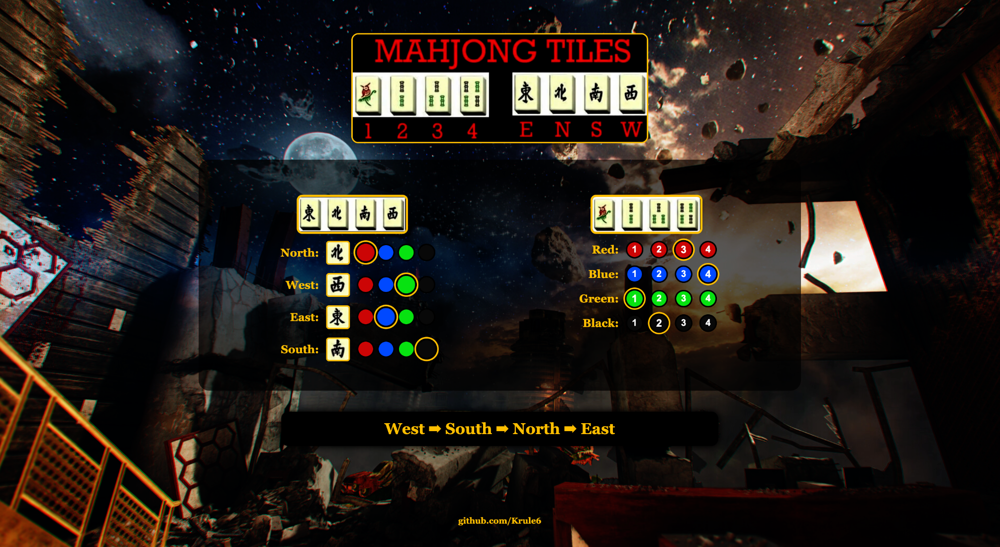

# Mahjong Tile Solver
A simple and interactive Mahjong Tile Solver Web app. Helps players to keep track of which order to hit each corner on the pylon for the last step of the Die Rise Easter Egg (Richtofens side).
## Preview

## Installation
1. Download the ZIP file.
2. Unzip it and open `start-html` in your preffered web browser(chrome, safari etc).
